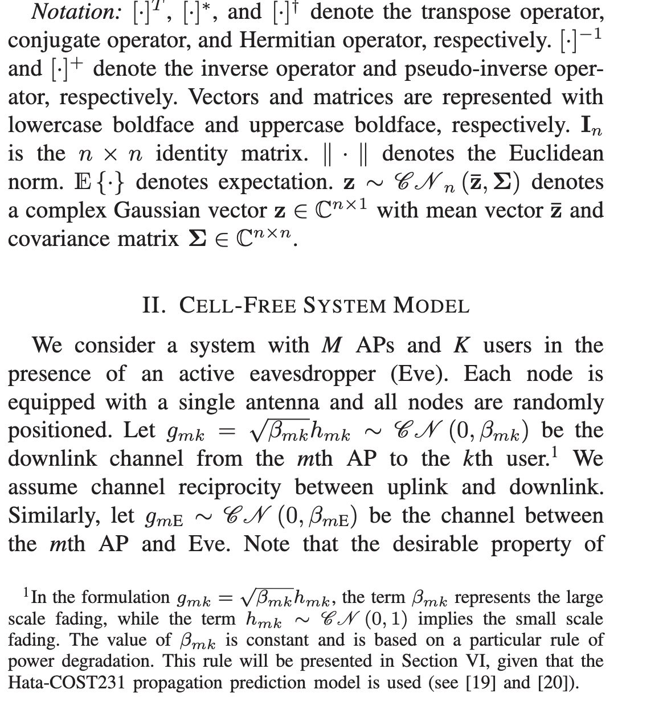
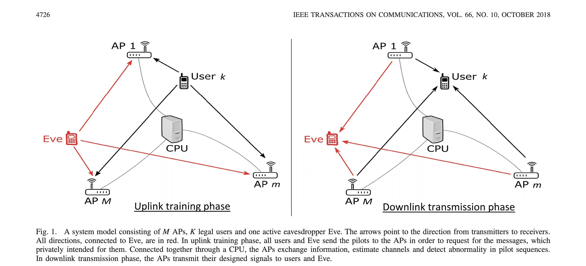
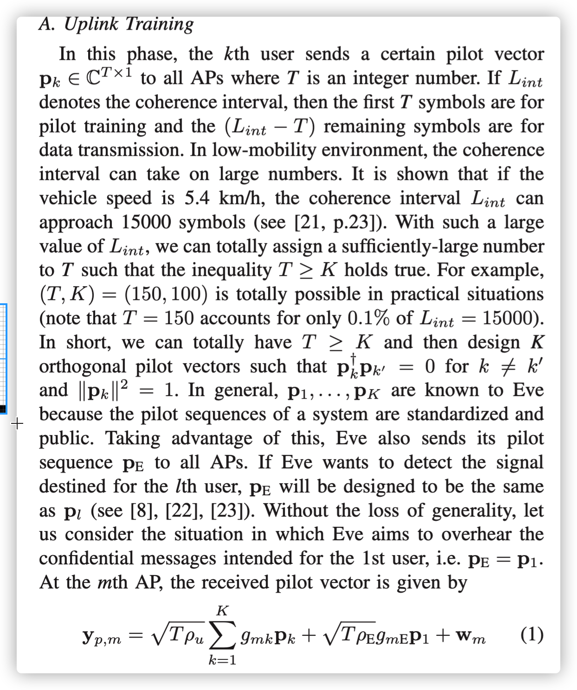

# 无蜂窝大规模MIMO网络：针对主动窃听的最优功率控制

## 摘要

本文研究了最近在导频欺骗攻击下引入的“无小区大规模MIMO”网络的安全性。 首先，示出了一种简单的方法来识别对特定用户的这种类型的主动窃听攻击的存在。 为了应对这种攻击，我们考虑了使被攻击用户可达到的数据速率或其可达到的保密速率最大化的问题。 还并行考虑了相应的使受安全约束的功耗最小化的问题。 开发了路径跟踪算法来解决在不同功率分配给接入点（AP）时提出的优化问题。 在为AP分配设备功率时，这些优化问题采用闭式解决方案。 数值结果表明了其有效性。

## 介绍

### A 预备知识

#### 1无蜂窝大规模MIMO网络：

[1] – [3]最近引入了无蜂窝大规模MIMO网络。 这些论文表明，通过适当的实现，无蜂窝大规模MIMO可以为网络中的所有用户提供统一的优质服务，并且在吞吐量方面胜过小蜂窝大规模MIMO，并且可以更有效地处理阴影衰落相关性。 在典型的小蜂窝大规模MIMO系统中，从接入点（AP）到用户的信道是单标量。相比之下，在无小区大规模MIMO系统中，所有AP都可以通过中央处理器（CPU）彼此联络以执行波束形成传输任务，并且有效信道（从AP到用户）将采用两个向量之间的内积的形式[2]。当每个向量的长度（相当于ap的个数）足够大时，内积可以收敛到其平均值，因此，有效信道也收敛到一个恒定值，并且在使用无小区结构的大型MIMO系统中不需要估计下行信道，而小小区对应的则可以信道估计需要上下行链路训练。

受[1] – [3]的启发，[4] – [7]中进一步研究了无小区大规模MIMO。 [4]中对无小区大规模MIMO进行了修改，以允许每个AP基于最强的信道仅服务于几个用户，而不是服务于所有用户。 在[5]中考虑了联合用户协会和干扰/功率控制以减轻干扰和小区边缘效应。 在[6]中考虑了设计零强制预编码器以最大化无小区大规模MIMO网络的能量效率的问题。 我们有动机去研究无蜂窝大规模MIMO的安全性，因为在当前研究中并未考虑它。

#### 2导频欺骗攻击：

最近，主动窃听吸引了研究人员对物理层安全性的关注。 事实证明，主动窃听者比被动窃听者更为危险，因为泄露给主动窃听者的机密信息可能更高[8]。 主动窃听是近年来出现的一个有趣的话题。 例如，主动窃听者既可以进行干扰，也可以进行窃听[9]-[11]，和可以发送欺骗性的引导序列[8]，[12]，[13]。 后一种情况与所谓的导频欺骗攻击[8]，[12]有关。 主动窃听者引起的窃听攻击比被动窃听者更具危害性。 在[12]中提出了一种基于反馈的编码方案，以提高传输的保密性。 相反，从窃听的角度来看，[8]显示了主动窃听者如何利用传输能量实现令人满意的性能。

由[8]发起，已经对无线安全性中的飞行员欺骗攻击进行了积极的研究[13] – [18]。 Kapetanovicet等人[13]，Wuet等人[14]，Imet等人[15]，Tugnait [16]和Xionget等人通过假设在训练阶段，窃听者可以攻击无线通信系统来获取泄漏的信息量。 [17]，[18]研究了在不同情况下的飞行员污染攻击。 他们的结果表明，主动窃听通常会对不同类型的无线系统构成实际威胁。更具体地说，[13]中的作者进行了一项调查，以检测大规模MIMO系统上的主动攻击。 Wuet等人[14]设计了一种人工噪声来应对不安全的大规模MIMO系统中的主动窃听器。本文中不需要使用人工噪声，因为我们提出的优化问题还可以控制波束向预期目标的转向，从而满足安全性约束。同时，还应考虑Imet等人[15]。 [15]是秘密密钥的生成，不在本文的讨论范围之内。[16]中使用一种称为最小描述长度源枚举的方法来检测中继网络中的主动窃听攻击。但是，不会评估系统的安全性能（通过诸如保密率或保密中断概率之类的指标）。其他检测技术可以在[17]和[18]中找到。虽然[17]借助下行链路阶段来估计信道并改善系统性能，但我们仅使用一个训练阶段来检测潜在的窃听者（在附录A中进行了介绍）。我们的简单检测技术与[18]中的类似，并且比较了用于检测窃听者的接收信号功率电平的不对称性。 [18]和我们的论文之间的差异在于建模（大规模MIMO网络与无小区网络）和优化公式。**`尽管[16]-[18]中的窃听攻击检测方法确实很有吸引力，但我们不会深入研究类似的方法，也不会将这种方法视为主要的贡献。相反，我们将重点放在解决优化问题上，以便在确实怀疑用户是窃听者的情况下为无单元系统提供特定的解决方案。**`

### B 贡献

如上所述，与小蜂窝网络相比，无蜂窝大规模MIMO网络的引入可带来巨大的吞吐量提高机会。 因此，我们研究了这种网络的安全性，更重要的是，本文是将安全性与无蜂窝大规模MIMO架构进行集成的第一篇工作。 另一方面，这项工作中的分析方法与先前有关大规模MIMO安全性的论文不同。 主要区别在于我们不使用大数定律来计算信噪比（SNR）的近似表达式。 取而代之的是，我们考虑SNR表达式的下限和上限，从而计算并评估了保密率的下限。 当然，这种替代方法在节点/天线的数量不是很多的一般情况下是正确的（因此可以相对理解和/或也可以删除术语“质量”）。

在本文中，我们研究了一个无蜂窝网络，在训练阶段，窃听者在其中积极参与了对系统的攻击。 我们简单且简短地表明这种攻击很危险，但可以通过简单的检测机制将其检测出来。 从而，可以做出应对主动窃听的努力，并且可以在下一阶段（即，下行链路阶段）期间在AP处准备安全策略。 考虑到这些并以保持机密信息安全为目的，我们可以提前意识到哪个用户受到攻击，因此，我们可以基于保密标准提出优化问题，以保护该用户免于开销。 我们提出的优化问题可以分为2组。 对于第一组，我们设计一个功率控制系数矩阵：

- 使遭受攻击的用户可获得的数据速率最大化（请参阅III-A）
- 最大化用户1的可达保密率(见III-B）
- 最大限度地降低所有AP的总功率，但要受每个用户（包括合法用户和窃听者）的数据速率的限制（请参阅IV-A）
- 尽量减少所有AP的总功率，但要受到可达到的数据速率和其他用户（即不受攻击的合法用户）的数据速率的约束（请参阅IV-B）。

对于第二组，我们为所有AP设计一个通用的功率控制系数，并考虑4个优化问题（V-A，V-B，V-C和V-D），这些问题与第一组中的相似和可比。 虽然所有最大化程序的目标都是可以实现的保密率，但是所有最小化程序的目标都是AP的功耗。 通过控制每个AP的功率，我们找到了针对所提出的优化问题的最合适的解决方案，并将它们在安全性能和能源方面进行了比较。

本文的其余部分安排如下。 在第二部分中，介绍了系统模型。 在第三节中，我们提出了两个最大化问题，以最大程度地提高可达到的保密率，但要考虑几个服务质量约束。 同时，第四节提供了两个最小化问题以最小化功耗，从而仍然可以保证安全性约束。 在第五节中，出于比较目的给出了所提出的优化问题的特殊情况。在第六节和第七节中分别给出了仿真结果和结论。

表示法：[·] T，[·] *和[·]†分别表示转置运算符，共轭运算符和厄米运算符。[·] -1和[·] +表示逆运算符和伪逆运算符 分别。 向量和矩阵分别用小写黑体和大写黑体表示。然后，In 是单位矩阵。”||·||”表示欧几里得范数。E{·}表示期望值。 ̄zand协方差矩阵Σ∈Cn×n。

## 无蜂窝系统模型

我们考虑一个具有主动窃听者（Eve）的M个用户接入点和K个users的系统。 每个节点都配备有单个天线，并且所有节点都是随机放置的

 

请注意，通道互易性的理想特性要求对硬件进行高度准确的校准。
此外，无蜂窝大规模MIMO系统中的AP通过回程连接到CPU，从而可以共享信息。 我们假设回程已足够完善，仅考虑无错误信息。 任何容量上的限制（由不完善的回程引起）将留待以后的工作。

传输包括两个阶段:上行信道估计训练和下行数据传输

### 上传训练

